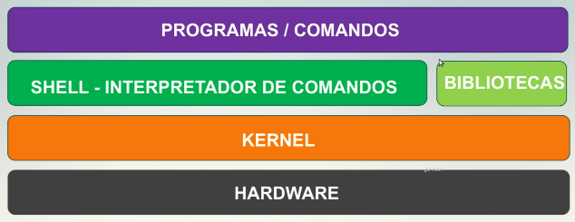

# Table of Contents

1.  [intro](#orgca18dd3)

# intro

Shell ->

o shell nada mais é do que o interpretador de comandos, um programa que analisa o que foi digitado na linha de comando e executa esses comandos

verificar quais shells estão disponiveis no sistema atual ->

    chsh -l
    
    cat /etc/shells

a variável $SHLVL demonstra o nivel do shell atual, exemplo ->

    [13:11][]~ ✮ ps fu
    USER         PID %CPU %MEM    VSZ   RSS TTY      STAT START   TIME COMMAND
    estagia+    6793  0.0  0.0  14760  8176 pts/5    Ss+  13:04   0:00 -zsh
    estagia+    6752  0.0  0.0  14660  7932 pts/4    Ss+  13:04   0:00 -zsh
    estagia+    4643  0.0  0.0  18400  9560 pts/1    Ss+  12:51   0:00 -zsh
    estagia+    5618  0.0  0.0  18248  9212 pts/2    Ss   12:57   0:00 /usr/bin/zsh
    estagia+    7564  300  0.0  13764  4608 pts/2    R+   13:11   0:00  \_ ps fu

    [13:11][]~ ✮ ps fu
    USER         PID %CPU %MEM    VSZ   RSS TTY      STAT START   TIME COMMAND
    estagia+    6793  0.0  0.0  14760  8176 pts/5    Ss+  13:04   0:00 -zsh
    estagia+    6752  0.0  0.0  14660  7932 pts/4    Ss+  13:04   0:00 -zsh
    estagia+    4643  0.0  0.0  18400  9560 pts/1    Ss+  12:51   0:00 -zsh
    estagia+    5618  0.0  0.0  18248  9212 pts/2    Ss   12:57   0:00 /usr/bin/zsh
    estagia+    7583  3.3  0.0  15028  8560 pts/2    S    13:11   0:00  \_ zsh
    estagia+    7617  0.0  0.0  13764  4608 pts/2    R+   13:11   0:00      \_ ps fu

