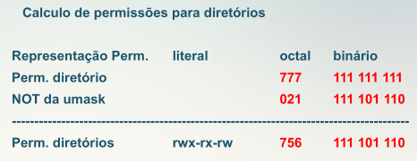
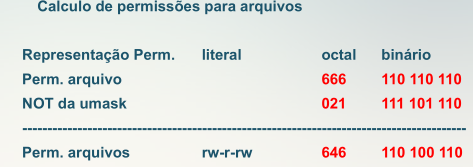
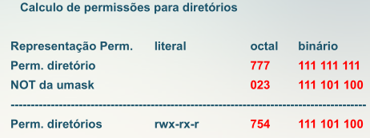
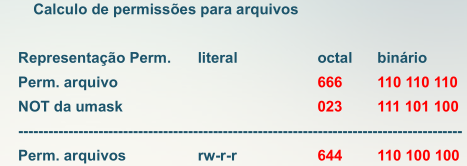
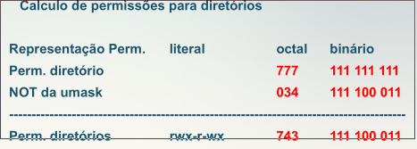
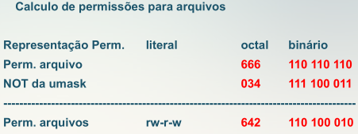

# Table of Contents

1.  [exemplos](#org353d005)

Existe um comando interno do shell que é responsável por definir as permissões padrões para novos arquivos e diretórios criados por um usuário, este comando é o `umask`

**Certs only work with perm 600(octal)**

    umask
    
    [13:48][]~ ✮ umask
    002

Para visualizar as permissões aplicadas pelo umask ->

    umask -S

Este comando pode ser definido nos arquivos profiles, ou seja, **/etc/profile** que é utilizado por todos os usuários do sistema.

Para calcular as permissões para novos arquivos e diretórios utilizando a umask, as seguintes permissões devem ser levadas em consideração para o calculo

**&ldquo;Default&rdquo; Permissions** ->

<table border="2" cellspacing="0" cellpadding="6" rules="groups" frame="hsides">

<colgroup>
<col  class="org-left" />

<col  class="org-right" />

<col  class="org-left" />
</colgroup>
<tbody>
<tr>
<td class="org-left">Arquivos</td>
<td class="org-right">666</td>
<td class="org-left">rw-rw-rw</td>
</tr>

<tr>
<td class="org-left">Diretórios</td>
<td class="org-right">777</td>
<td class="org-left">rwx-rwx-rwx</td>
</tr>
</tbody>
</table>

**Permissions** ->

<table border="2" cellspacing="0" cellpadding="6" rules="groups" frame="hsides">

<colgroup>
<col  class="org-left" />

<col  class="org-right" />

<col  class="org-left" />
</colgroup>
<tbody>
<tr>
<td class="org-left">Leitura</td>
<td class="org-right">4</td>
<td class="org-left">r</td>
</tr>

<tr>
<td class="org-left">Escrita</td>
<td class="org-right">2</td>
<td class="org-left">w</td>
</tr>

<tr>
<td class="org-left">Execução</td>
<td class="org-right">1</td>
<td class="org-left">x</td>
</tr>

<tr>
<td class="org-left">Leitura , Escrita e Execução</td>
<td class="org-right">7</td>
<td class="org-left">rwx</td>
</tr>

<tr>
<td class="org-left">Leitura e Escrita</td>
<td class="org-right">6</td>
<td class="org-left">rw</td>
</tr>

<tr>
<td class="org-left">Leitura e Execução</td>
<td class="org-right">5</td>
<td class="org-left">rx</td>
</tr>

<tr>
<td class="org-left">Escrita e Execução</td>
<td class="org-right">3</td>
<td class="org-left">wx</td>
</tr>
</tbody>
</table>

**Binary representation** ->

<table border="2" cellspacing="0" cellpadding="6" rules="groups" frame="hsides">

<colgroup>
<col  class="org-right" />

<col  class="org-right" />
</colgroup>
<tbody>
<tr>
<td class="org-right">0</td>
<td class="org-right">000</td>
</tr>

<tr>
<td class="org-right">1</td>
<td class="org-right">001</td>
</tr>

<tr>
<td class="org-right">2</td>
<td class="org-right">010</td>
</tr>

<tr>
<td class="org-right">3</td>
<td class="org-right">011</td>
</tr>

<tr>
<td class="org-right">4</td>
<td class="org-right">100</td>
</tr>

<tr>
<td class="org-right">5</td>
<td class="org-right">101</td>
</tr>

<tr>
<td class="org-right">6</td>
<td class="org-right">110</td>
</tr>

<tr>
<td class="org-right">7</td>
<td class="org-right">111</td>
</tr>
</tbody>
</table>

# exemplos

Default perm binary for files 110 110 110 (666 octal)
Default Perm binary for dir 111 111 111 (777 octal)

**1 for dirs** ->
umask = 021 (octal umask)
000 010 001 (binary umask)
111 101 110 (not umask)

**1 for files** ->
umask = 021(octal umask)
000 010 001(binary umask)
111 101 110(not umask)

**2 for dirs** ->
umask = 023(octal umask)
000 010 011(binary umask)
111 101 100(not umask)

**2 for files** ->
umask = 023(octal umask)
000 010 011(binary umask)
111 101 100(not umask)

**3 for dirs** ->
umask = 034(octal umask)
000 011 100(binary umask)
111 100 011(not umask)

**3 for file** ->
umask = 034(octal umask)
000 011 100(binary umask)
111 100 011(not umask)

